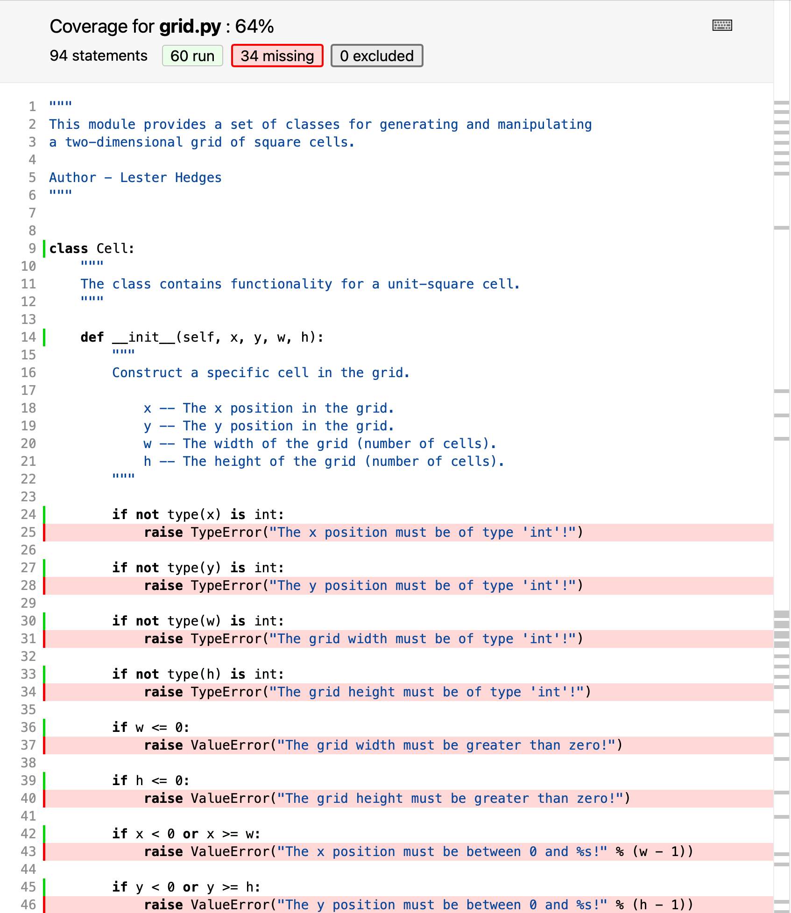

So far we have written tests to cover the cases that we can think of, either
where we believe the code should work, or where it should generate a particular
error. When `pytest` notices these expectations not matching reality, the test
fails and we are alerted to the problem.

But what about the problems we haven't even considered? Could there be some code
hiding in our repository that is not tested, and so could go wrong at any
moment?

A useful concept to help with this is the idea of _code coverage_. This is, for
a particular application, module, or function, the percentage of lines of code
that are executed at least once by the test suite&mdash;so at least in some
sense are "tested".

There is a variety of tools available to assist with assessing code coverage.
One of these is `coverage`; let's install this now, as well as an extension to
`pytest` to integrate with `coverage`.

~~~
$ pip install pytest-cov coverage
~~~
{: .language-bash}

Now, going back to the `grid` directory, we can run `pytest`, but asking it to
collect coverage data and save it in the current directory.

~~~
$ pytest --cov=./
~~~
{: .language-bash}

~~~
========================= test session starts =======================
platform darwin -- Python 3.8.5, pytest-6.2.2, py-1.10.0, pluggy-0.13.1
rootdir: /Users/ed/src/python-testing-ci/code_test/grid
plugins: cov-2.11.1
collected 9 items

test/test_cell.py   .........    [100%]

---------- coverage: platform darwin, python 3.8.5-final-0 -----------
Name                Stmts   Miss  Cover
---------------------------------------
__init__.py             1      0   100%
grid.py                94     34    64%
test/__init__.py        0      0   100%
test/test_cell.py      64      0   100%
---------------------------------------
TOTAL                 159     34    79%

========================= 9 passed in 0.06s =========================
~~~
{: .output}

In addition to the test progress and results, we now also see a summary table of
the coverage of each of the modules in the project. Unsurprisingly, the tests
are 100% covered, as `pytest` runs all the code there. `grid.py` however is
currently only 64% covered. This isn't necessarily a problem&mdash;100% coverage
isn't always necessary, and we're already significantly better than 0%
coverage&mdash;but it would be good to take a closer look and see where is and
isn't covered.

~~~
$ coverage html
~~~
{: .language-bash}

This reads the coverage information saved by `pytest`, and creates a graphical
report in HTML format that we can open in a web browser. Opening
`htmlcov/index.html` in your web browser of choice will show you a prettier
version of the summary table above, but now, clicking on `grid.py` will give a
line-by-line breakdown of what is and isn't covered by tests.

Looking through line-by-line, we can see that places that aren't tested include
the consistency checks in the `__init__()` method of `Cell`, and methods such as
`occupied`, `fill`, and `empty`. It's a good idea for all functions (and
methods) to have at least one test, so this test suite would benefit from being
expanded.

> It's worth pointing out again that 100% coverage is not essential for a good
> test suite. If the coverage is below 100%, then that indicates that it's worth
> understanding where the uncovered lines of code are, and whether it is worth
> the time investment to write tests for them. For example, many programs leave
> the `if __name__ == '__main__'` block untested, as testing it adds complexity
> for little gain.
>
> Conversely, 100% coverage does not guarantee that every possible problem has
> been discovered. If the same person writes the tests and the code, it's likely
> that a forgotten corner case in the code will also be forgotten in the test
> suite; as there is no code there to not be tested, the coverage statistic will
> not highlight a problem here.
>
> Code coverage is just one tool in your testing arsenal to help you identify
> areas you may have forgotten to test; it is not useful as a metric to compare
> between projects.
{: .callout}

## Coverage and continuous integration

As well as checking that our tests pass, we can also get our continuous
integration workflow to check and report on the code coverage. A useful tool to
help with this is [Codecov][codecov], which will keep a history of your coverage
data over time so you can visualise trends in it, and as a bonus will generate a
badge that you can include alongside the CI workflow status.

To do this, firstly you'll need to create an account with [Codecov][codecov].
Sign in with your GitHub account to link your Codecov account to your GitHub
one, so your repositories will automatically show up.

Then, we need to make three changes to the `.github/workflows/pytest.yaml` file:

1. Add the `codecov` and `pytest-cov` packages to the installation step.
2. Update the `pytest` step to generate coverage data as well as running the test suite.
3. Add an extra step to upload the data to Codecov.

With these done, our `pytest.yaml` file looks as follows:

~~~
name: Run tests

on:
  push:
    branches: [ main ]
  pull_request:
    branches: [ main ]

jobs:
  build:

    runs-on: ubuntu-latest
    strategy:
      matrix:
        python-version: [3.7, 3.8, 3.9]

    steps:
    - uses: actions/checkout@v3
    - name: Set up Python ${{ matrix.python-version }}
      uses: actions/setup-python@v4
      with:
        python-version: ${{ matrix.python-version }}
    - name: Install dependencies
      run: |
        python -m pip install --upgrade pip
        python -m pip install pytest pytest-cov codecov
    - name: Test with pytest
      run: |
        pytest --cov=./
    - name: Upload coverage report
      run: |
        codecov
~~~
{: .language-yaml}

With these edits made, now we can commit the changes and push them to GitHub.

~~~
$ git add .github/workflows/pytest.yaml
$ git commit -m 'add coverage reporting to CI workflow'
$ git push origin main
~~~
{: .language-bash}

Once the workflow has had time to run, going back to [Codecov][codecov] will
show the `grid` repository. Clicking through, you can see visualisations of the
coverage now, and the historical coverage over time. You can also drill down
into reports similar to the ones that were generated by `coverage html`.

Now that Codecov is aware of the repository, we can ask it for a coverage badge,
as well. Going to **Settings** > **Badge**, we can copy the Markdown and add it
to our `README.md`.

~~~
$ nano README.md
$ git add README.md
$ git commit -m 'add coverage badge to README [ci skip]'
$ git push origin main
~~~
{: .language-bash}

Now our `README.md` shows the percentage coverage of the test suite, as well as whether it passes.

> ## Try it yourself
>
> Switch back to the `dice` directory again. In the previous episode, you set up
> a CI workflow for this repository. Now, adjust this workflow so that it also
> measures and reports on code coverage, and add a badge from [Codecov][codecov]
> to the `README.md`.
{: .challenge}

[codecov]: https://codecov.io
